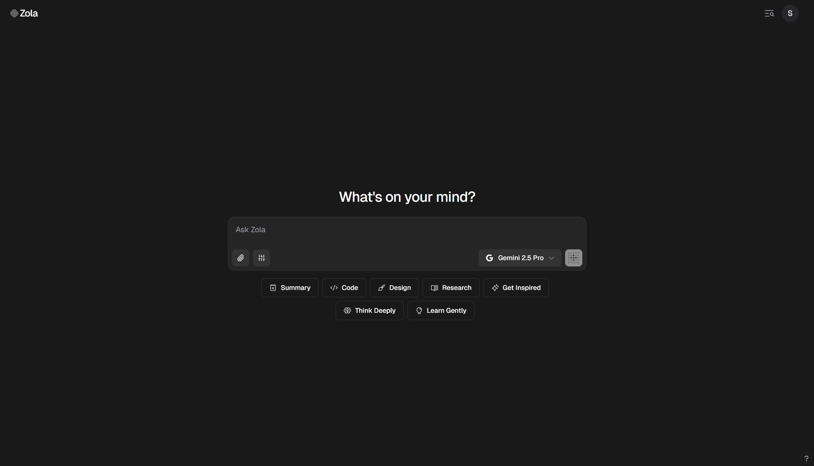
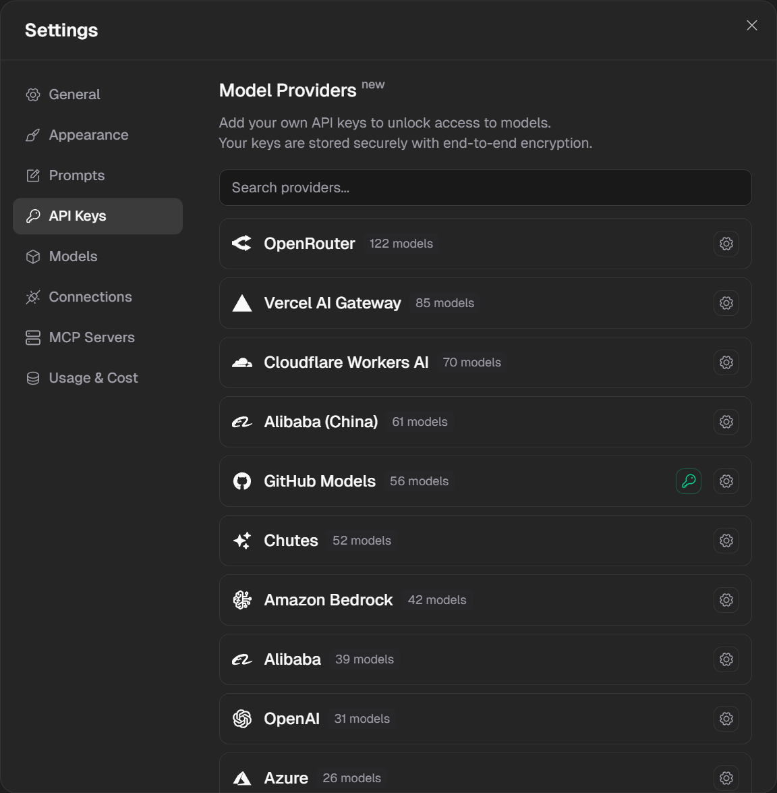
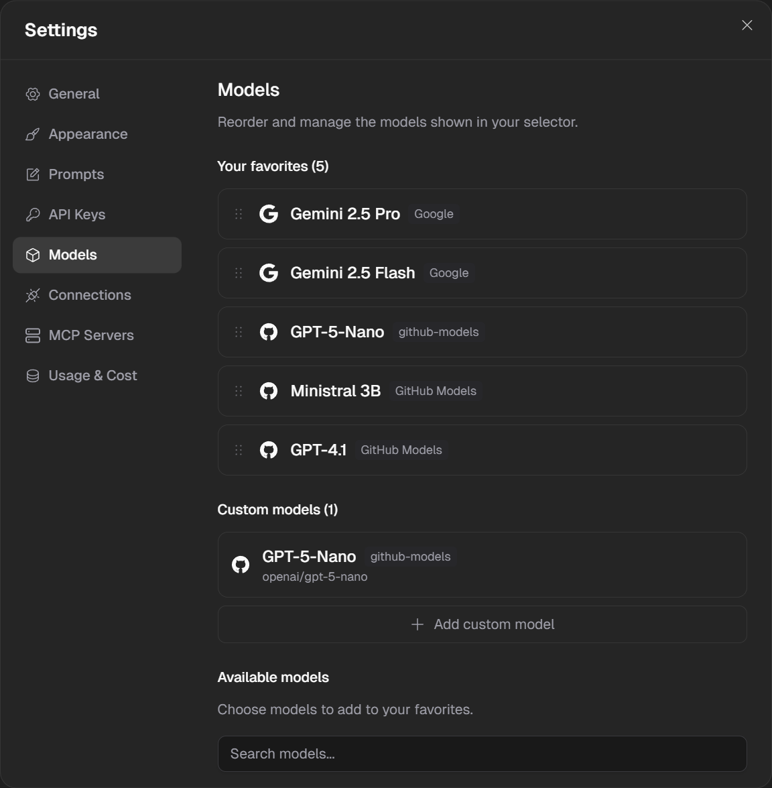
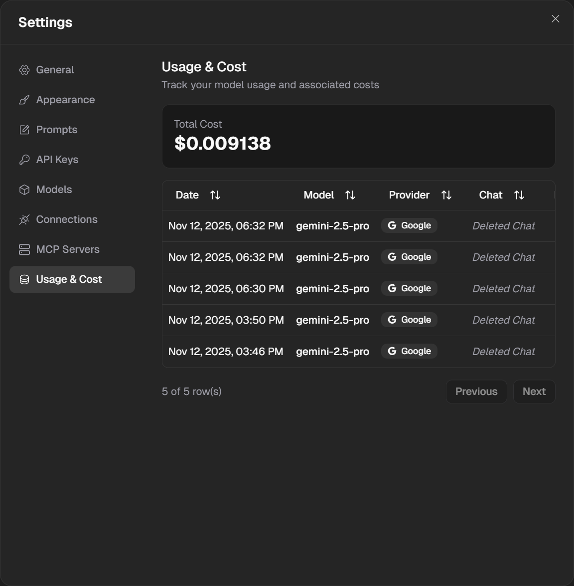
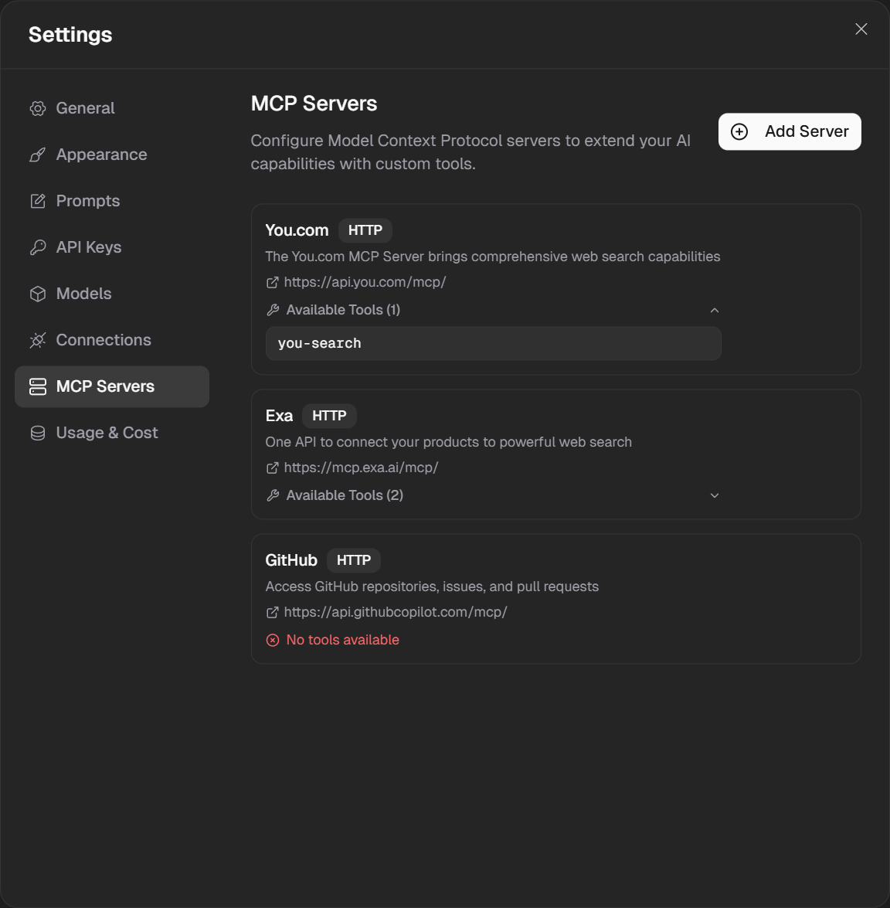

<div align="center">
  

# Zola

### The Open-Source Multi-Model AI Chat Interface

**Unified access to 100+ AI models from OpenAI, Anthropic, Google, Mistral, and more**

[](LICENSE)
[](https://nextjs.org)
[](https://www.typescriptlang.org)
[](https://sdk.vercel.ai)

[Website](https://zola.chat) • [Documentation](./INSTALL.md) • [Discord](#) • [Twitter](#)

[](https://vercel.com/new/clone?repository-url=https://github.com/SilkePilon/zola)

</div>

> [!WARNING]
> **This project is under active development!** Some features may be incomplete or subject to change. We're working hard to bring you the best AI chat experience.
>
> **Current Status:**
>
> - [X] Vercel AI SDK v5 integration
> - [X] Usage tracking & cost monitoring
> - [X] MCP (Model Context Protocol) servers
> - [X] Models.dev API integration
> - [ ] Next.js 15 compatibility updates
> - [X] Budget limits and warnings system

---

## Screenshots

<div align="center">

### Main Chat Interface



### Model Providers



### Available Models



### Usage & Cost Tracking



### MCP Servers



</div>

---

## Features

### Multi-Model Support

Access over 100 AI models from all major providers through a single interface. Switch between models seamlessly during conversations. Powered by the [models.dev](https://models.dev) API with support for OpenAI, Anthropic, Google, Mistral, xAI, Perplexity, and many more providers.

### Bring Your Own Key (BYOK)

Use your own API keys securely with AES-256 encryption. Store keys for all major providers without vendor lock-in. Users can manage their own API keys through the settings interface, maintaining full control over their usage and billing.

### Local AI with Ollama

Run AI models completely locally on your machine with Ollama integration. Automatic model detection means no configuration needed. Enjoy zero API costs and complete privacy. Support for popular models like LLaMA, Mistral, Gemma, Qwen, Phi, and more.

### Beautiful, Modern Interface

Clean and responsive design that works on all devices. Supports both light and dark themes with multiple layout options. Built with modern technologies including Tailwind CSS and shadcn/ui for a polished user experience.

### Custom Models

Add your own AI models to the interface through the settings panel. Use any OpenAI-compatible API endpoint. Configure model capabilities including vision, tools, reasoning, audio, and video support. Full control over pricing information and context window sizes.

### Advanced Features

- File uploads supporting images, documents, and PDFs
- Model Context Protocol (MCP) support for extended capabilities
- Multi-model conversations in a single chat
- Customizable system prompts per chat or globally
- Project organization for managing multiple conversations
- Chat history with search and filtering
- Export conversations in multiple formats

---

## Quick Start

### Option 1: Cloud Models (OpenAI, Anthropic, etc.)

```bash
# Clone the repository
git clone https://github.com/SilkePilon/zola.git
cd zola

# Install dependencies
npm install

# Start the development server
npm run dev
```

Open [http://localhost:3000](http://localhost:3000) in your browser, then add your API keys through the Settings interface. Navigate to Settings > API Keys and securely add keys for the providers you want to use. All keys are encrypted before storage.

### Option 2: Local AI with Ollama (Recommended)

```bash
# Install Ollama
curl -fsSL https://ollama.ai/install.sh | sh

# Pull a model (e.g., LLaMA 3.2)
ollama pull llama3.2

# Clone and run Zola
git clone https://github.com/SilkePilon/zola.git
cd zola
npm install
npm run dev
```

Zola will automatically detect all your Ollama models. No configuration needed - just start chatting with your local models completely free and private.

> [!TIP]
> Using Ollama is completely free and runs entirely on your machine. Perfect for privacy-conscious users or those who want to avoid API costs!

### Option 3: Docker with Ollama

```bash
git clone https://github.com/SilkePilon/zola.git
cd zola
docker-compose -f docker-compose.ollama.yml up
```

Access Zola at [http://localhost:3000](http://localhost:3000). Add API keys for cloud providers through Settings, or use the pre-configured Ollama models immediately.

---

## Documentation

### Full Installation Guide

For complete setup instructions including database configuration (Supabase), authentication setup (Google OAuth, guest mode), file upload configuration, and environment variables, see the [INSTALL.md](./INSTALL.md) guide.

> [!NOTE]
> Zola requires a Supabase account for authentication and data storage. A free tier is available and sufficient for personal use.

### Adding Custom Models

Zola supports adding custom AI models in two ways:

#### Method 1: Add Custom Models via UI

1. Log in to your Zola instance
2. Open Settings and navigate to Models
3. Click "Add Custom Model"
4. Fill in the model details:
   - Model Name: Display name (e.g., "My Custom GPT-4")
   - Model ID: The actual model identifier (e.g., `gpt-4-custom`)
   - Provider: Select from available providers or use "Custom"
   - Base URL (if Custom): Your API endpoint (e.g., `https://api.example.com/v1`)
   - Context Window: Maximum tokens (e.g., `128000`)
   - Pricing: Input/output cost per 1M tokens
   - Capabilities: Enable vision, tools, reasoning, audio, video support
5. Click "Add Model"

Your custom model will now appear in the model selector. 2. **Fork the [models.dev repository](https://github.com/modelcontextprotocol/models.dev)** 3. **Add your provider/model** to `api.json`:

#### Method 2: Contribute to models.dev

To make your model available to all Zola users and the broader AI community:

1. Visit [models.dev](https://models.dev)
2. Fork the [models.dev repository](https://github.com/modelcontextprotocol/models.dev)
3. Add your provider/model to `api.json`:

```
{
    "api": "https://api.yourprovider.com/v1",
    "env": ["YOUR_PROVIDER_API_KEY_ENV_VAR"],
    "models": {
        "your-model-id": {
            "id": "your-model-id",
            "name": "Your Model Name",
            "tool_call": true,
            "attachment": true,
            "cost": {
                "input": 0.5,
                "output": 1.5
            },
            "limit": {
                "context": 128000,
                "output": 4096
            },
            "modalities": {
                "input": ["text", "image"],
                "output": ["text"]
4. **Submit a Pull Request**
5. Once merged, your model will be available in Zola (and other tools using models.dev)!

> [!TIP]
> Contributing to models.dev makes your model available not just in Zola, but across the entire ecosystem of tools that use the models.dev API!

#### OpenAI-Compatible APIs
```

4. **Submit a Pull Request**
5. Once merged, your model will be available in Zola (and other tools using models.dev)!

#### OpenAI-Compatible APIs

Zola works with any OpenAI-compatible API. Popular options include:

- OpenRouter - Access 100+ models through one API
- Together AI - Fast inference for open-source models
- Replicate - Run models with auto-scaling
- LocalAI - Self-hosted OpenAI alternative
- LM Studio - Desktop app with API server
- Text Generation WebUI - Popular UI with OpenAI API extension
