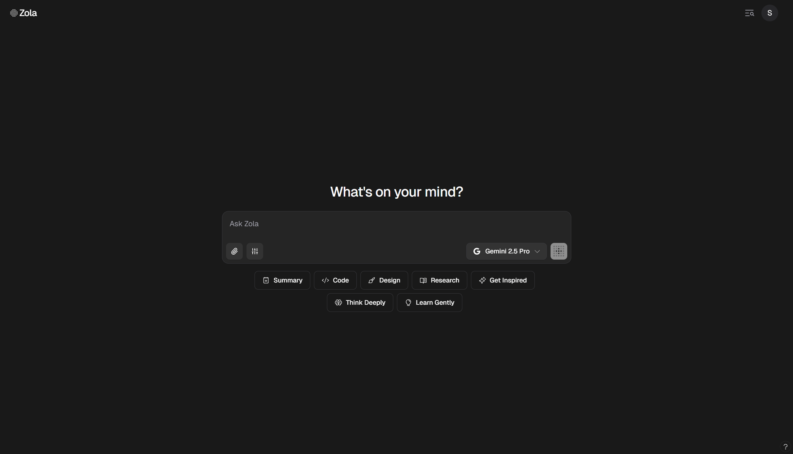
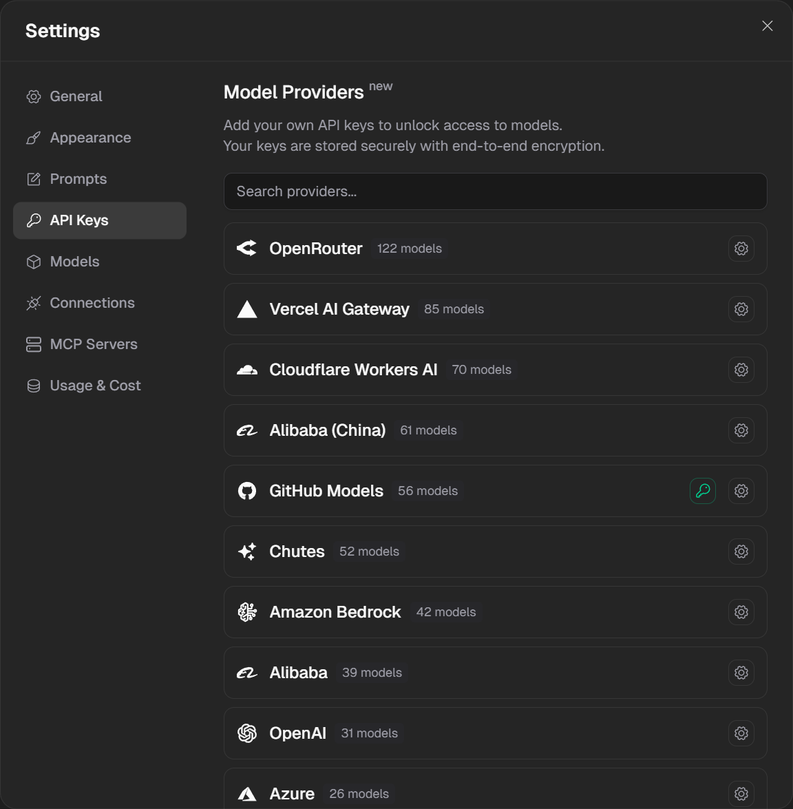
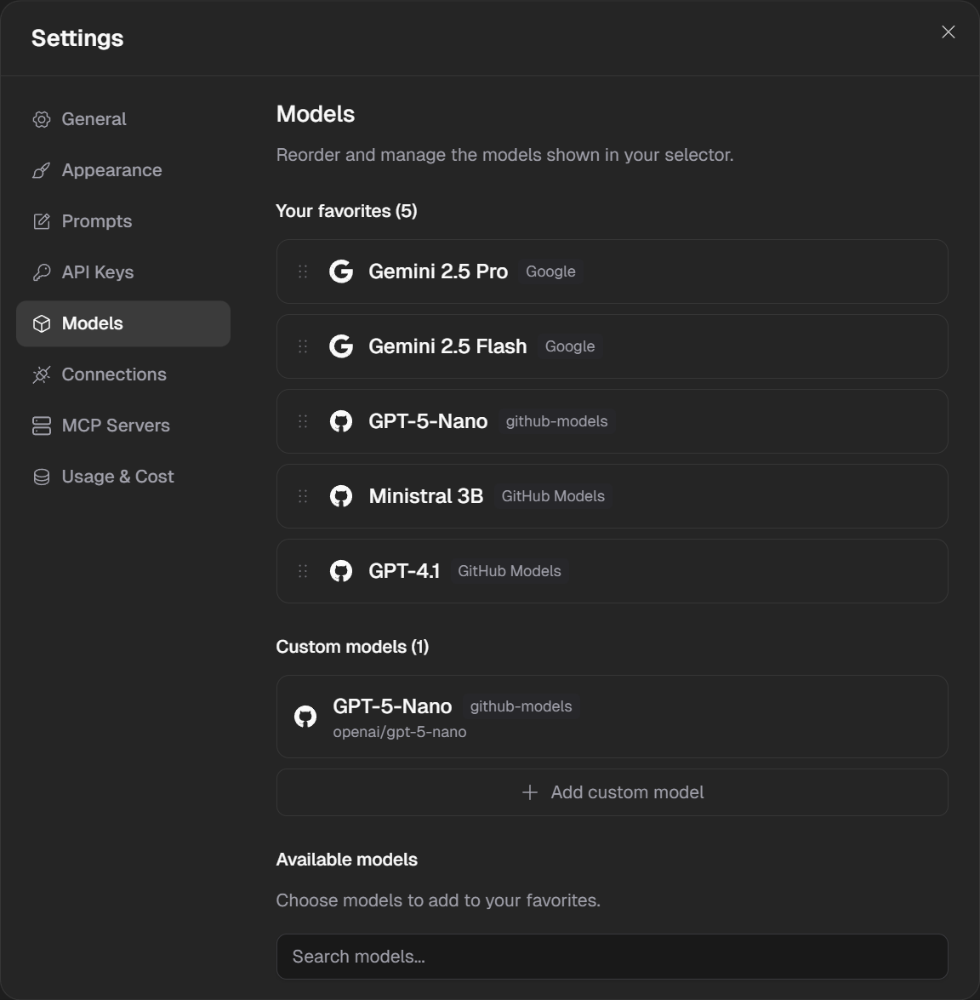
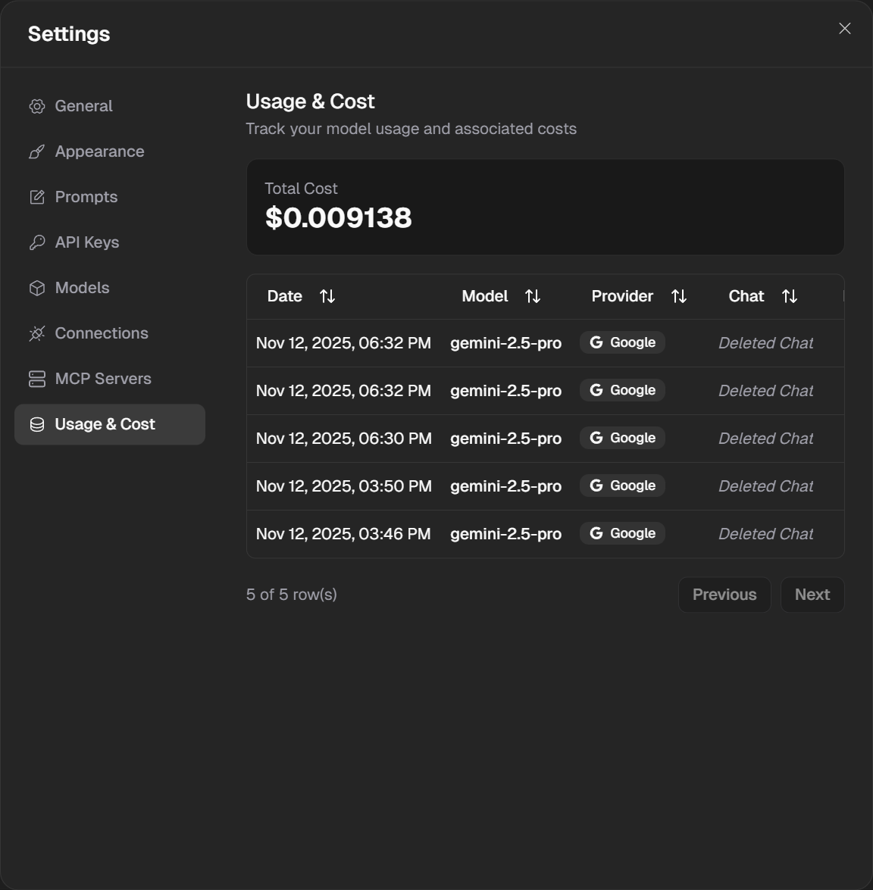
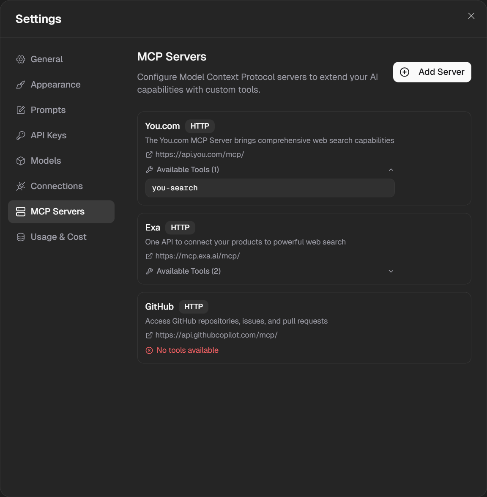

<div align="center">
  

# Zola

### The Open-Source Multi-Model AI Chat Interface

**Unified access to 100+ AI models from OpenAI, Anthropic, Google, Mistral, and more**

[](LICENSE)
[](https://nextjs.org)
[](https://www.typescriptlang.org)
[](https://sdk.vercel.ai)

[Website](https://zola.chat) • [Documentation](./INSTALL.md) • [Discord](#) • [Twitter](#)

[](https://vercel.com/new/clone?repository-url=https://github.com/SilkePilon/zola)

</div>

> [!WARNING]
> **This project is under active development!** Some features may be incomplete or subject to change. We're working hard to bring you the best AI chat experience.
>
> **Current Status:**
>
> - [X] Vercel AI SDK v5 integration
> - [X] Usage tracking & cost monitoring
> - [X] MCP (Model Context Protocol) servers
> - [X] Models.dev API integration
> - [x] Budget limits and warnings system
> - [ ] Next.js 15 compatibility updates
> - [ ] Use Zola as OpenAi compatible server

---

## Screenshots

<div align="center">

### Main Chat Interface



### Model Providers



### Available Models



### Usage & Cost Tracking



### MCP Servers



</div>

---

## Features

### Multi-Model Support

Access over 100 AI models from all major providers through a single interface. Switch between models seamlessly during conversations. Powered by the [models.dev](https://models.dev) API with support for OpenAI, Anthropic, Google, Mistral, xAI, Perplexity, and many more providers.

### Bring Your Own Key (BYOK)

Use your own API keys securely with AES-256 encryption. Store keys for all major providers without vendor lock-in. Users can manage their own API keys through the settings interface, maintaining full control over their usage and billing.

### Local AI with Ollama

Run AI models completely locally on your machine with Ollama integration. Automatic model detection means no configuration needed. Enjoy zero API costs and complete privacy. Support for popular models like LLaMA, Mistral, Gemma, Qwen, Phi, and more.

### Beautiful, Modern Interface

Clean and responsive design that works on all devices. Supports both light and dark themes with multiple layout options. Built with modern technologies including Tailwind CSS and shadcn/ui for a polished user experience.

### Custom Models

Add your own AI models to the interface through the settings panel. Use any OpenAI-compatible API endpoint. Configure model capabilities including vision, tools, reasoning, audio, and video support. Full control over pricing information and context window sizes.

### Advanced Features

- File uploads supporting images, documents, and PDFs
- Model Context Protocol (MCP) support for extended capabilities
- Multi-model conversations in a single chat
- Customizable system prompts per chat or globally
- Project organization for managing multiple conversations
- Chat history with search and filtering
- Export conversations in multiple formats

---

## Quick Start

Zola needs Postgres (data + auth) and MinIO (file uploads). Docker Compose brings up all three services, applies the database migrations, and starts the app — it's the fastest way in and the recommended setup.

### Docker (recommended)

**Prerequisites:** [Docker](https://docs.docker.com/get-docker/) with Compose v2 (`docker compose version`).

```bash
# 1. Clone
git clone https://github.com/SilkePilon/zola.git
cd zola

# 2. Create your env file
cp .env.example .env.local

# 3. Generate the three required secrets and append them
{
  echo "ENCRYPTION_KEY=$(openssl rand -base64 32)"
  echo "BETTER_AUTH_SECRET=$(openssl rand -hex 32)"
  echo "CSRF_SECRET=$(openssl rand -hex 32)"
} >> .env.local

# 4. Start everything
docker compose up -d
```

Open [http://localhost:3000](http://localhost:3000), create an account with email and password, then add your AI provider keys under **Settings > API Keys** (encrypted at rest with AES-256).

That's the whole setup. Postgres, MinIO, and database migrations are all handled for you.

> [!NOTE]
> `.env.local` has duplicate keys after step 3 (the empty ones from `.env.example` and the generated ones appended). The last value wins, so this works — edit the file by hand if you'd rather keep it tidy.

**Useful commands:**

```bash
docker compose logs -f zola    # tail app logs
docker compose down            # stop
docker compose down -v         # stop and delete all data
docker compose up -d --build   # rebuild after changing code
```

### Docker with Ollama

Adds a local Ollama container for free local models with no API keys. `docker-compose.ollama.yml` is an *override*, so pass both files (base first) — it reuses the Postgres, MinIO, and migration setup from the main compose file:

```bash
# After the same clone + .env.local steps as above
docker compose -f docker-compose.yml -f docker-compose.ollama.yml up -d

# Pull a model
docker compose -f docker-compose.yml -f docker-compose.ollama.yml exec ollama ollama pull llama3.2
```

Zola detects your Ollama models automatically — no configuration needed.

> [!TIP]
> Ollama is completely free and runs entirely on your machine. Ideal if you're privacy-conscious or want to avoid API costs.

### Local development

Only needed if you're changing Zola's code. `npm run dev` does **not** start Postgres or MinIO, so bring those up with Docker first:

```bash
git clone https://github.com/SilkePilon/zola.git
cd zola
npm install

cp .env.example .env.local
{
  echo "ENCRYPTION_KEY=$(openssl rand -base64 32)"
  echo "BETTER_AUTH_SECRET=$(openssl rand -hex 32)"
  echo "CSRF_SECRET=$(openssl rand -hex 32)"
} >> .env.local

# Start just the dependencies
docker compose up -d postgres minio

# Create the schema, then run the dev server
npm run db:migrate
npm run dev
```

The default `.env.example` values already point at those containers on `localhost`.

---

## Documentation

### Full Installation Guide

[INSTALL.md](./INSTALL.md) covers everything: environment variables, authentication (email/password plus optional Google and GitHub OAuth via Better Auth, with guest sessions), database configuration (self-hosted Postgres + Drizzle), file uploads (MinIO), Ollama, production deployment, and troubleshooting.

> [!NOTE]
> Zola needs Postgres and MinIO to run — `docker compose up -d` provides both, along with the app. There's no reduced-functionality mode without them.

### Adding Custom Models

Zola supports adding custom AI models in two ways.

#### Method 1: Add a Custom Model via the UI

1. Sign in to your Zola instance
2. Open **Settings** > **Models**
3. Click **Add Custom Model**
4. Fill in the model details:
   - **Model Name** — display name (e.g. "My Custom GPT-4")
   - **Model ID** — the actual model identifier (e.g. `gpt-4-custom`)
   - **Provider** — pick an existing provider, or "Custom"
   - **Base URL** (if Custom) — your API endpoint (e.g. `https://api.example.com/v1`)
   - **Context Window** — maximum tokens (e.g. `128000`)
   - **Pricing** — input/output cost per 1M tokens
   - **Capabilities** — vision, tools, reasoning, audio, video
5. Click **Add Model**

The model appears in your model selector immediately. Custom models are stored per-user.

#### Method 2: Contribute to models.dev

To make a model available to every Zola user — and to the wider ecosystem:

1. Fork the [models.dev repository](https://github.com/modelcontextprotocol/models.dev)
2. Add your provider/model to `api.json`:

```json
{
  "api": "https://api.yourprovider.com/v1",
  "env": ["YOUR_PROVIDER_API_KEY_ENV_VAR"],
  "models": {
    "your-model-id": {
      "id": "your-model-id",
      "name": "Your Model Name",
      "tool_call": true,
      "attachment": true,
      "cost": { "input": 0.5, "output": 1.5 },
      "limit": { "context": 128000, "output": 4096 },
      "modalities": { "input": ["text", "image"], "output": ["text"] }
    }
  }
}
```

3. Submit a pull request

Once merged, the model is available in Zola automatically — no change to this repository is needed, since the catalog is fetched from the models.dev API at runtime.

> [!TIP]
> Contributing to models.dev makes your model available not just in Zola, but across the entire ecosystem of tools that use the models.dev API.

#### OpenAI-Compatible APIs

Zola works with any OpenAI-compatible API. Popular options include:

- **OpenRouter** - Access 100+ models through one API
- **Together AI** - Fast inference for open-source models
- **Replicate** - Run models with auto-scaling
- **LocalAI** - Self-hosted OpenAI alternative
- **LM Studio** - Desktop app with API server
- **Text Generation WebUI** - Popular UI with OpenAI API extension

---

## Contributing

Issues and pull requests are welcome — see [GitHub Issues](https://github.com/SilkePilon/zola/issues).

To add support for a new model or provider, contribute to [models.dev](https://models.dev) rather than this repo (see above).

## License

Zola is open-source software licensed under the [Apache License 2.0](LICENSE).
